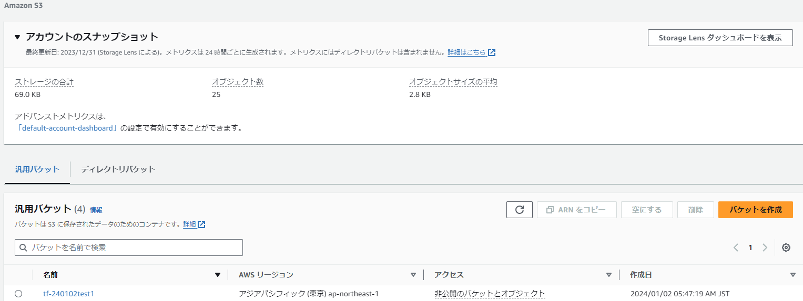

# AWS CLIのインストール方法のメモ
Windows環境でpipによるAWS CLIのインストール方法のメモです。
## 背景
以下の想いから環境用意することにしました。
* Terraformを使いたい
* EC2にAWS CLIを入れるのではなく、ローカルにAWS CLIを置いてやってみたい
* 既にPythonの実行環境とpipはローカル側で整っていたので、pipからAWS CLIを導入したい
## 参考記事
* （公式）[Python と pip を使用した Windows での AWS CLI バージョン 1 のインストール、更新、アンインストール](https://docs.aws.amazon.com/ja_jp/cli/v1/userguide/install-windows.html#awscli-install-windows-pip)
* [【VSCode + Git Bash】Windows に Node.js や AWS CLI の環境を構築する方法](https://blog.css-net.co.jp/entry/dev-environment-windows#2-3-1-AWS-CLI-%E3%82%A4%E3%83%B3%E3%82%B9%E3%83%88%E3%83%BC%E3%83%AB)
  >環境変数への追加はしていなくて、VScodeを再起動するだけでawsコマンドが有効になるようです。

## 前提
* Python：3.12.0
* pip：23.3.2
* CLI：Command Prompt
  * はじめは「Git Bash」を使っていたのですが、環境変数にPATHを通すことがうまくできず、コマンドプロンプトに変えました。
  * ↑トライしてはいないですが、Git Bashが動作する仕組みから理解しないといけない気がします（以下参考記事）
    * https://hackmd.io/@kit-web-team/gitbash


## 実施
### AWS CLIのインストール
* いったんpipをアップグレード
```bash
python.exe -m pip install --upgrade pip
```
* aws cliをインストール
```bash
pip install awscli --upgrade --user
```
ここでいったんVScode（ターミナル）を再起動

* aws cliのインストール確認
```bash
aws --version
>aws-cli/1.32.11 Python/3.12.0 Windows/11 botocore/1.34.11
```

### AWS CLIの初期設定
#### 前提
* `aws configure`コマンドでconfigファイル作成する際、アクセスキーIDとシークレットアクセスキーが必要になるので、まずこれらを生成します。
* 「AdministratorAccess」権限で設定しようと思いますが、アカウント自体はあるので、今回はアクセスキー発行からやります。
#### 参考記事
* （公式）[アクセスキーを取得する](https://docs.aws.amazon.com/ja_jp/cli/latest/userguide/cli-authentication-user.html#cli-authentication-user-get)
* [【AWS】Terraformを使うための環境準備](https://cloud5.jp/saitou-terraform-start/)
* [【VSCode + Git Bash】Windows に Node.js や AWS CLI の環境を構築する方法](https://blog.css-net.co.jp/entry/dev-environment-windows#2-3-1-AWS-CLI-%E3%82%A4%E3%83%B3%E3%82%B9%E3%83%88%E3%83%BC%E3%83%AB)

#### 実施
* 上記の参考記事通り実施して、アクセスキーIDとシークレットアクセスキーを取得します。これらが記述された.csvファイルをDLできるので、DLしてローカルに格納します。
* いったんユーザー名のディレクトリに戻ります
```bash
cd ~
pwd
>/c/Users/username
```
* 初期設定
  * AWS Access Key ID、AWS Secret Access Key に先ほど発行した値をそれぞれコピペで入力・Enter
  * Default region name、Default output formatはそれぞれ以下の通り入力しました
```bash
aws configure
>AWS Access Key ID [None]: AKI**************
>AWS Secret Access Key [None]: **************
>Default region name [None]: ap-northeast-1
>Default output format [None]: json
```
* `aws configure`したディレクトリで.awsフォルダが生成されるのでいちおう中身確認
```bash
ls -a | grep .aws
>.aws/
ls .aws
>config  credentials
```
* それぞれ以下の記述となっています
  * config
  ```sh:config
  [default]
  region = ap-northeast-1
  output = json
  ```
  * credential
  ```sh:credential
  [default]
  aws_access_key_id = AKI**************
  aws_secret_access_key = **************
  ```
* 以下のコマンドで、自分のアカウントが取得できるか確認
```bash
aws sts get-caller-identity
>{
    "UserId": "A*****************",
    "Account": "14XXXXXXXXXX",
    "Arn": "arn:aws:iam::14XXXXXXXXXX:user/kaxxxxxxxxxx"
  }
```

#### Terraformの動作確認
S3バケットを作ってコンソールで確認してみる
>（注意）`s3://`の後ろはバケットの名前なので好きに入力ください。ただ、よくある名前だと重複問題？ではじかれるので、独自性の高い名前で。
* S3バケット作成
```bash
aws s3 mb s3://tf-240102test1
```
* コンソール画面で確認


* S3バケット削除(確認したら不要なので)
```bash
aws s3 rb s3://tf-240102test1 --force
>remove_bucket: tf-240102test1
```

以上です。背景に記載のTerraformの利用までは別リポジトリとして以下の通りメモを残します。
* [Terraformのローカルへのインストール方法のメモ](https://github.com/kawasaki8108/Terraform_Install)
* [CloudFormationで構築した環境をTerraformで構築する](https://github.com/kawasaki8108/tf-raisetech-lec10cfn)
